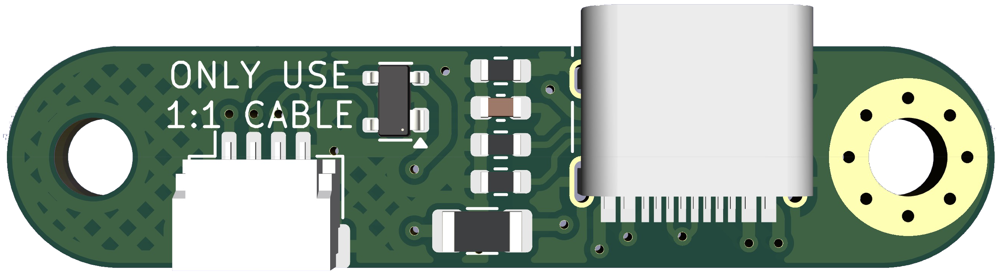

# Unified Daughterboard SX

> Based on https://github.com/Unified-Daughterboard/UDB-S  
> &copy; 2023 Unified Daughterboard Project

The Unified Daughterboard is an open standard to unify the USB daughterboards used in custom mechanical keyboard projects.

## This spinoff 

The UDB project has progressed to 3 distinct variants:
- C-JSH with JST PH connector
- C-EZM with Molex Pico-EZmate connector
- and a thinner variant S, also with EZmate connector

These new C5 and S1 variants have opted to merge shield grounding and cable ground, but this variant of the S is, *a)* more cautious on case/cable grounding and protects the circuit ground with a 4.7 µF capacitor and a 1 MΩ resistor that are used as a **common EMI (Electromagnetic Interference) and ESD (Electrostatic Discharge) filtering network**, and *b)* uses the JST connector of the original C3 project.

